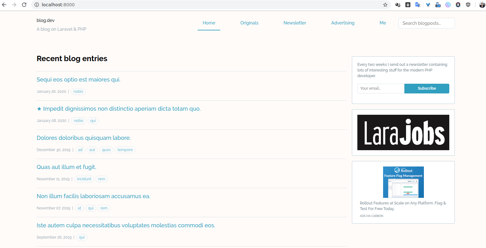

# Blog feito em Laravel
<p align="center"></p>
# Blog
## spatie/freek.dev
## murze.be

```
- Editar .env
- composer install
- php artisan migrate
- php artisan db:seed --class=UserSeeder
- npm install
- npm run development
- php artisan key:generate
- php artisan serve
```

## Importa banco WordPress (ImportWp.php)
- php artisan import:wp -v

- https://github.com/spatie/freek.dev
- @cpdrenato


```
npm run dev
npm run development
npm run watch
npm run watch-poll
npm run hot
npm run prod
npm run production
npm run imagemin
npm run lint:css
npm run lint:js
```

<p align="center"></p>

## Detalhes
> Tem a area do admin para fazer os Posts
> /admin

> Sobre a migração do meu blog do WordPress para um aplicativo Laravel
- https://freek.dev/906-on-migrating-my-blog-from-wordpress-to-a-laravel-application

# This Vue component 
- https://github.com/spatie/freek.dev/blob/2734ddc/resources/assets/js/front/components/SearchPosts.vue

```
	<template>
	    <div style="position: relative">
	        <div>
	            <input class="search-input" placeholder="Search blogposts..." v-model="query" type="text"
	                   @input="performSearch">
	        </div>

	        <div v-if="query.length" class="search-results">
	            <div v-if="hits.length">
	                <ul v-for="hit in hits">
	                    <li><a :href="hit.url" v-html="hit._highlightResult.title.value"></a></li>
	                </ul>
	            </div>
	            <div v-else>
	                <div>
	                    <div class="bg-blue text-white text-sm font-bold p-2" role="alert">
	                        <p>No blogposts found...</p>
	                    </div>
	                </div>
	            </div>
	            
	        </div>
	    </div>
	</template>

	<script>
	    import algoliasearch from 'algoliasearch';
	    export default {
	        props: ['appId', 'apiKey', 'indexName'],
	        data() {
	            return {
	                query: '',
	                index: null,
	                hits: [],
	            };
	        },
	        created: function () {
	            const client = algoliasearch(this.appId, this.apiKey);
	            this.index = client.initIndex(this.indexName);
	        },
	        methods: {
	            performSearch(event) {
	                this.index.search({query: this.query}, (error, results) => {
	                    console.log()
	                    this.hits = results.hits;
	                });
	            }
	        }
	    }
	</script>
```

Details [here](https://murze.be/on-migrating-my-blog-from-wordpress-to-a-laravel-application).

# The source code of https://freek.dev
## Security

If you discover any security related issues, please email freek@spatie.be instead of using the issue tracker.

- [Freek Van der Herten](https://github.com/freekmurze)

- Renato Lucena